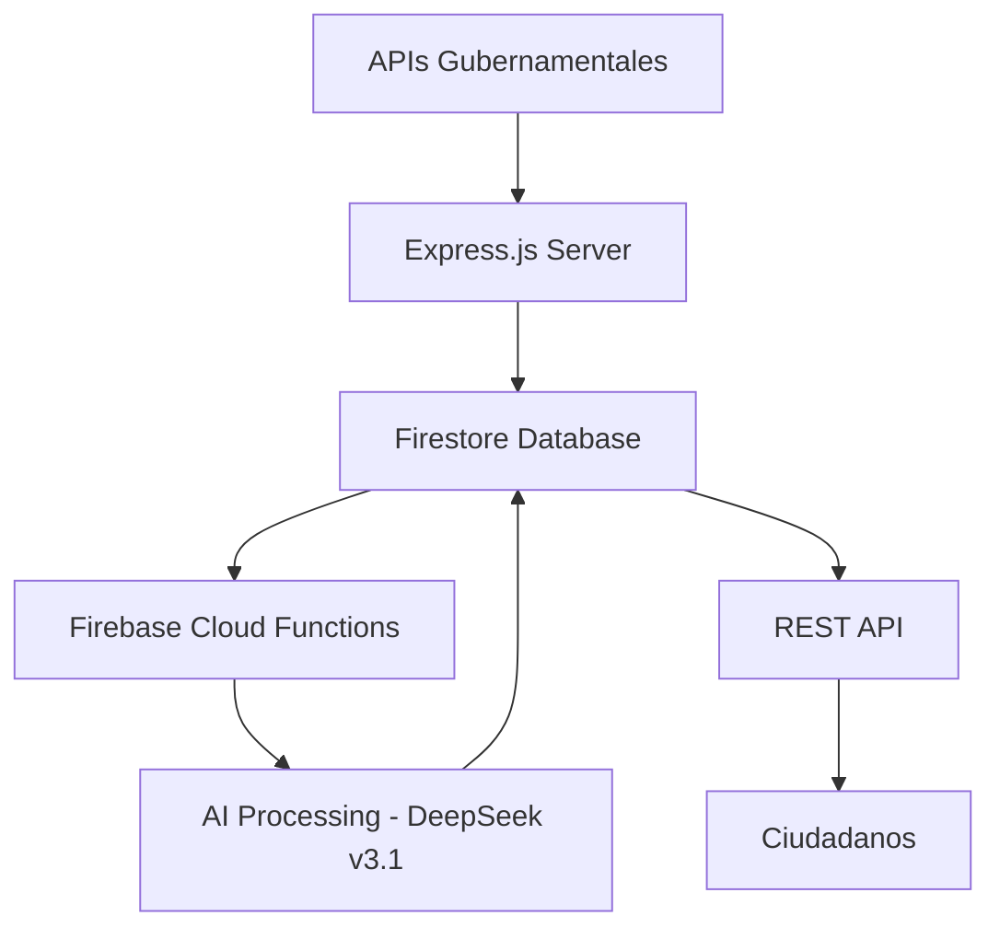

# Los Honorables - Documentación del Proyecto

<div align="center">
  <h2>🏛️ Sistema de Democratización de Información Legislativa Chilena</h2>
  <p><strong>Versión:</strong> 1.0.0 | <strong>Autor:</strong> Winnie Cofre | <strong>Licencia:</strong> MIT</p>
</div>

---

## 📋 Tabla de Contenidos

- [Descripción General](#-descripción-general)
- [Arquitectura del Sistema](#-arquitectura-del-sistema)
- [Flujo de Datos](#-flujo-de-datos)
- [Estructura del Proyecto](#-estructura-del-proyecto)
- [API Endpoints](#-api-endpoints)
- [APIs Externas](#-apis-externas)
- [Procesamiento de Datos](#-procesamiento-de-datos)
- [Integración con IA](#-integración-con-ia)
- [Estado de Implementación](#-estado-de-implementación)
- [Características Clave](#-características-clave)
- [Dependencias](#-dependencias)
- [Scripts Disponibles](#-scripts-disponibles)
- [Configuración](#-configuración)
- [Flujo de Desarrollo](#-flujo-de-desarrollo)
- [Lógica de Negocio](#-lógica-de-negocio)
- [Mejoras Futuras](#-mejoras-futuras)
- [Consideraciones Técnicas](#-consideraciones-técnicas)

---

## 🎯 Descripción General

**Los Honorables** es un sistema innovador diseñado para democratizar el acceso a la información legislativa chilena. El proyecto facilita a los ciudadanos comunes el acceso a datos legislativos del Congreso Nacional de Chile, procesando información compleja mediante inteligencia artificial para generar explicaciones simples y categorizaciones comprensibles.

### Objetivo Principal
Facilitar el acceso del ciudadano común a datos legislativos del Congreso Nacional de Chile, procesando información compleja mediante IA para generar explicaciones simples y categorizaciones.

### Audiencia Objetivo
Ciudadanos chilenos interesados en seguir la actividad legislativa de manera accesible y comprensible.

---

## 🏗️ Arquitectura del Sistema

### Tipo de Arquitectura
**REST API + Firebase Backend + AI Processing**

### Stack Tecnológico

| Componente | Tecnología |
|------------|------------|
| **Runtime** | Node.js con TypeScript |
| **Framework** | Express.js |
| **Base de Datos** | Supabase (PostgreSQL) |
| **Plataforma Cloud** | Supabase |
| **Modelo de IA** | DeepSeek v3.1 (planificado) |
| **Procesamiento de Datos** | XML to JSON conversion |
| **Gestor de Paquetes** | bun |
| **Herramienta de Build** | TypeScript compiler |

### Despliegue



- **Cloud Functions**: Firebase Cloud Functions para tareas programadas
- **Hosting**: Firebase Hosting
- **Programación**: Semanal automático + ejecución manual opcional

---

## 🔄 Flujo de Datos

### Proceso de 6 Pasos

1. **📥 Consulta APIs Públicas**
   - Obtención de datos del Senado y Cámara de Diputados

2. **🔄 Conversión XML a JSON**
   - Transformación de datos XML gubernamentales a JSON estructurado

3. **💾 Almacenamiento en Firestore**
   - Persistencia de datos estructurados

4. **🤖 Procesamiento con IA**
   - Generación de explicaciones y categorizaciones mediante DeepSeek v3.1

5. **🗃️ Caché de Respuestas IA**
   - Almacenamiento de respuestas IA para evitar reconsultas

6. **🌐 Exposición via API REST**
   - Acceso público a información procesada

### Fuentes de Datos

| Fuente | URL | Tipo |
|--------|-----|------|
| **Primaria** | https://opendata.camara.cl/ | Cámara de Diputados |
| **Secundaria** | https://tramitacion.senado.cl/wspublico/ | Senado |
| **Formato** | XML convertido a JSON | - |

---

## 📁 Estructura del Proyecto

### Archivos Raíz

```
los-honorables/
├── 📄 package.json                    # Configuración del proyecto y dependencias
├── 📄 tsconfig.json                   # Configuración de TypeScript
├── 📄 .env                            # Variables de entorno (credenciales Firebase)
├── 📄 horonables-firebase.json        # Configuración de Firebase
├── 📄 EndpointDiputadosAPI.json       # Documentación de 32 endpoints de la Cámara
├── 📄 README.md                       # Documentación del proyecto
├── 📄 context.json                    # Contexto completo del proyecto
└── 📄 CONTEXT.md                      # Esta documentación
```

### Estructura de Directorios

```
los-honorables/
├── src/                              # 📂 Código fuente principal
│   ├── 🖥️  server/                  # Configuración del servidor Express
│   ├── 🛣️  routes/                  # Endpoints REST organizados por funcionalidad (LEGACY)
│   │   ├── Diputados/
│   │   ├── Legislativo/
│   │   ├── PeriodosLegislativos/
│   │   ├── Proyectos/
│   │   ├── Sala/
│   │   ├── Senadores/
│   │   └── Votaciones/
│   ├── 🔧 utils/                    # Utilidades (XML/JSON, Firestore)
│   ├── ☁️  cloud/                   # Configuración Firebase
│   ├── ⚙️  config/                  # ⭐ Configuraciones centralizadas
│   │   ├── ai-config.ts             # Configuración para DeepSeek v3.1
│   │   └── endpoints-config.ts      # Configuración de endpoints externos
│   ├── 🏗️  api/                     # ⭐ API estructurada
│   │   ├── controllers/             # Controladores de endpoints
│   │   └── middlewares/             # Middlewares de validación
│   ├── 🔧 services/                 # ⭐ Servicios de negocio
│   │   ├── ai-processor/            # 🤖 Procesamiento con IA
│   │   │   └── deepseek-client.ts   # Cliente principal de DeepSeek v3.1
│   │   ├── data-collector/          # 📥 Recolección de datos externos
│   │   └── cache-manager/           # 🗃️ Gestión de caché
│   │       └── ai-cache.ts          # Caché específico para respuestas IA
│   ├── 📋 models/                   # ⭐ Modelos de datos
│   │   ├── firestore/               # 🔥 Modelos Firestore
│   │   │   ├── collections/         # 📁 Definiciones de colecciones
│   │   │   │   └── ai-explanations.model.ts  # Modelo para explicaciones IA
│   │   │   └── repositories/        # 📚 Repositorios de acceso a datos
│   │   └── types/                   # 🏷️ Tipos TypeScript
│   └── ⚡ functions/                # ⚡ Cloud Functions
│       ├── scheduled/               # 📅 Funciones programadas
│       │   └── weekly-data-processing.ts  # Procesamiento semanal principal
│       ├── manual/                  # 🖱️ Funciones manuales
│       └── shared/                  # 🔗 Utilidades compartidas
├── 📚 docs/                         # 📚 Documentación
│   ├── api/                         # 📋 Documentación de API
│   ├── architecture/                # 🏗️ Documentación arquitectural
│   └── deployment/                  # 🚀 Guías de despliegue
├── 🧪 tests/                        # 🧪 Pruebas unitarias
├── 📜 scripts/                      # 📜 Scripts de procesamiento
└── 📄 Archivos de configuración raíz
```

---

## 🌐 API Endpoints

### Base URL
```
http://localhost:6000
```

### Rutas Principales

#### 📋 `/projects` - Proyectos de ley y votaciones
- `GET /projects/on` - Health check
- `POST /projects/boletin` - Obtener votaciones por boletín

#### 📅 `/periodosLegislativos` - Períodos y legislaturas
- `GET /periodosLegislativos/on` - Health check
- `GET /periodosLegislativos/periodosLegislativos` - Todos los períodos
- `GET /periodosLegislativos/periodoActual` - Período actual

#### 👤 `/senadores` - Información de senadores
- `GET /senadores/on` - Health check
- `GET /senadores/vigentes` - Senadores vigentes

#### 👥 `/diputados` - Información de diputados
- `GET /diputados/on` - Health check
- `GET /diputados/vigentes` - Diputados vigentes

#### Rutas Adicionales
- `/legislativos` - Trámites legislativos
- `/servicioSala` - Sesiones de sala
- `/votaciones` - Detalles de votaciones

---

## 🌍 APIs Externas

### Cámara de Diputados
- **Base URL**: `https://opendata.camara.cl/camaradiputados/WServices/`
- **Total Endpoints**: 32 endpoints documentados
- **Formato**: XML

#### Categorías de Servicios

| Servicio | Descripción |
|----------|-------------|
| **WSComision** | Comisiones y sesiones |
| **WSDiputado** | Información de diputados |
| **WSProyectoAcuerdo** | Proyectos de acuerdo |
| **WSProyectoResolucion** | Proyectos de resolución |
| **WSSala** | Sesiones de sala |
| **WSLegislativo** | Trámites legislativos, votaciones, proyectos de ley |
| **WSComunes** | Datos comunes (regiones, comunas, tipos, etc.) |

### Senado
- **Base URLs**: 
  - `https://tramitacion.senado.cl/wspublico/`
  - APIs específicas para senadores y votaciones
- **Formato**: XML

---

## ⚙️ Procesamiento de Datos

### Conversión XML a JSON

**Librería**: `xml2js`

#### Configuración
```javascript
{
  explicitArray: false,    // No convierte elementos únicos en arrays
  ignoreAttrs: false,      // Mantiene los atributos
  mergeAttrs: true,        // Fusiona atributos con elementos
  normalize: true,         // Normaliza espacios en blanco
  explicitRoot: true       // Mantiene el elemento raíz
}
```

#### Funciones Utilitarias
- `convertXmlToJson(xmlData)` - Convierte XML a JSON
- `fetchAndProcessXml(url)` - Obtiene y procesa XML de una URL

### Almacenamiento en Base de Datos

**Plataforma**: Firestore (NoSQL document-based)

#### Colecciones Planificadas
```
📁 proyectos_ley          # Proyectos de ley
📁 votaciones             # Registros de votaciones
📁 diputados              # Información de diputados
📁 senadores              # Información de senadores
📁 sesiones               # Sesiones legislativas
📁 ai_explanations        # Explicaciones generadas por IA
📁 ai_categorizations     # Categorizaciones por IA
```

---

## 🤖 Integración con IA

### Modelo: DeepSeek v3.1

#### Propósitos de la IA
- ✨ **Explicaciones Simples**: Generar explicaciones comprensibles de proyectos de ley complejos
- 🏷️ **Categorización**: Clasificar proyectos por área (Social, Económico, Salud, etc.)
- 📊 **Análisis de Patrones**: Analizar patrones de votación de legisladores
- 📝 **Resúmenes**: Resumir decisiones legislativas de manera accessible

#### Optimización
- **💾 Caché**: Respuestas IA almacenadas en Firestore para evitar reconsultas
- **⏰ Programación**: Procesamiento semanal automático
- **🔧 Ejecución Manual**: Opción de trigger manual disponible

#### Cloud Functions
```javascript
{
  frequency: "Semanal",
  trigger_types: ["scheduled", "manual"],
  purpose: "Procesar nuevos datos y generar análisis IA"
}
```

---

## 📋 Archivos y Estructura Implementada

### ✅ Archivos Nuevos Creados

#### 🤖 Servicios de IA
- `src/services/ai-processor/deepseek-client.ts` - Cliente principal para DeepSeek v3.1
- `src/services/cache-manager/ai-cache.ts` - Sistema de caché para respuestas IA

#### ⚙️ Configuración
- `src/config/ai-config.ts` - Configuraciones centralizadas para IA

#### 📋 Modelos de Datos
- `src/models/firestore/collections/ai-explanations.model.ts` - Modelo para explicaciones IA

#### ⚡ Cloud Functions
- `src/functions/scheduled/weekly-data-processing.ts` - Procesamiento automático semanal

### 📁 Directorios Creados

#### Estructura Completa Nueva:
```
src/
├── api/
│   ├── controllers/          # ⭕ VACÍO - Pendiente implementación
│   └── middlewares/          # ⭕ VACÍO - Pendiente implementación  
├── services/
│   ├── ai-processor/         # 🟡 PARCIAL - deepseek-client.ts creado
│   ├── data-collector/       # ⭕ VACÍO - Pendiente implementación
│   └── cache-manager/        # 🟡 PARCIAL - ai-cache.ts creado
├── models/
│   ├── firestore/
│   │   ├── collections/      # 🟡 PARCIAL - ai-explanations.model.ts creado
│   │   └── repositories/     # ⭕ VACÍO - Pendiente implementación
│   └── types/                # ⭕ VACÍO - Pendiente implementación
├── functions/
│   ├── scheduled/            # 🟡 PARCIAL - weekly-data-processing.ts creado
│   ├── manual/               # ⭕ VACÍO - Pendiente implementación
│   └── shared/               # ⭕ VACÍO - Pendiente implementación
└── config/                   # 🟡 PARCIAL - ai-config.ts creado

docs/
├── api/                      # ⭕ VACÍO - Pendiente documentación
├── architecture/             # ⭕ VACÍO - Pendiente documentación
└── deployment/               # ⭕ VACÍO - Pendiente documentación
```

### 🎯 Recomendaciones de Estructura Actualizadas

#### 📊 Directorio `src/data/` - OBSOLETO
El directorio `src/data/` contiene archivos vacíos y debe ser eliminado. Las funciones de obtención de datos deben moverse a:
- `src/services/data-collector/` - Para clientes de APIs externas
- `src/models/firestore/repositories/` - Para operaciones de base de datos

#### 🔥 Funciones y Métodos de Firestore - UBICACIÓN CORRECTA
Las operaciones de Firestore deben organizarse en:
- `src/models/firestore/repositories/` - Repositorios base y específicos
  - `base.repository.ts` - Clase base abstracta con operaciones CRUD
  - `proyecto-ley.repository.ts` - Repositorio específico para proyectos de ley
  - `votaciones.repository.ts` - Repositorio específico para votaciones

- `src/models/firestore/collections/` - Modelos de colecciones
  - `proyecto-ley.model.ts` - Interfaz TypeScript para proyectos de ley
  - `votacion.model.ts` - Interfaz TypeScript para votaciones
  - `ai-explanation.model.ts` - Modelo para explicaciones IA (ya implementado)

#### ⚡ Cloud Functions - UBICACIÓN CORRECTA
La estructura actual de Cloud Functions es adecuada:
- `src/functions/scheduled/` - Funciones programadas (ej: procesamiento semanal)
- `src/functions/manual/` - Funciones de ejecución manual (ej: sincronización forzada)
- `src/functions/shared/` - Utilidades compartidas entre funciones

#### 📥 Recolección de Datos Externos - ESTRUCTURA ACTUAL
La obtención de datos ya se realiza a través de las rutas en:
- `src/routes/SenadoresRoutes/` - Para datos del Senado
- `src/routes/DiputadosRoutes/` - Para datos de la Cámara de Diputados

Los archivos vacíos en `src/data/` deben ser eliminados ya que la funcionalidad ya existe en la estructura de rutas.

### 🚀 Próximos Archivos Críticos a Crear

#### Alta Prioridad:
1. `src/services/ai-processor/explanation-generator.ts`
2. `src/services/ai-processor/categorization-engine.ts`
3. `src/services/data-collector/senado-client.ts`
4. `src/services/data-collector/diputados-client.ts`
5. `src/models/types/legislative.types.ts`
6. `src/models/firestore/repositories/base.repository.ts`

#### Media Prioridad:
7. `src/functions/manual/force-data-sync.ts`
8. `src/functions/shared/function-utils.ts`
9. `src/api/controllers/projects.controller.ts`
10. `src/api/middlewares/validation.middleware.ts`

---

## 📊 Estado de Implementación

### ✅ Completado
- [x] Estructura base del proyecto TypeScript/Express
- [x] Configuración Firebase/Firestore
- [x] Utilidades de conversión XML a JSON
- [x] Endpoints básicos para salud del API
- [x] Documentación de 32 endpoints de Cámara de Diputados
- [x] Scripts de procesamiento de endpoints
- [x] Rutas organizadas por dominio funcional
- [x] **Estructura de directorios nueva** (services, models, functions, api)
- [x] **Archivos base de IA** (deepseek-client.ts, ai-config.ts, ai-cache.ts)
- [x] **Modelo base para explicaciones IA** (ai-explanations.model.ts)
- [x] **Función programada base** (weekly-data-processing.ts)
- [x] **Identificación de directorios obsoletos** (src/data/ - debe ser eliminado)

### 🔄 En Progreso
- [x] ✅ Reestructuración de directorios para escalabilidad
- [ ] Implementación completa de servicios de IA
- [ ] Clientes de APIs externas (Senado + Diputados)
- [ ] Modelos TypeScript para entidades legislativas
- [ ] Repositorios Firestore
- [ ] Funciones de almacenamiento en Firestore
- [ ] Pruebas unitarias

### 📋 Planificado
- [ ] **Motor de explicaciones ciudadanas** (explanation-generator.ts)
- [ ] **Motor de categorización automática** (categorization-engine.ts)
- [ ] Integración completa con APIs externas
- [ ] Sistema de caché avanzado en Firestore
- [ ] Integración completa con DeepSeek v3.1
- [ ] Cloud Functions para procesamiento automático
- [ ] API mejorada con controllers y middlewares
- [ ] Dashboard de monitoreo
- [ ] Documentación de API completa

---

## ⭐ Características Clave

### 🌐 Democratización de Datos
Convierte información legislativa compleja en datos accesibles para ciudadanos comunes.

### 🤖 Análisis Potenciado por IA
Utiliza inteligencia artificial para generar explicaciones y categorizaciones automáticas.

### ⚡ Actualizaciones en Tiempo Real
Procesamiento programado semanal de nuevos datos legislativos.

### 🏛️ Cobertura Completa
Incluye información de ambas cámaras del Congreso Nacional de Chile.

### 👥 Enfoque Ciudadano
Diseñado específicamente para el ciudadano común, no para especialistas legales.

### 📈 Arquitectura Escalable
Firebase permite escalamiento automático según demanda.

### 💰 Optimización de Costos
Sistema de caché de respuestas IA para minimizar costos operacionales.

---

## 📦 Dependencias

### Runtime Dependencies
```json
{
  "express": "^4.21.2",
  "axios": "^1.7.9", 
  "xml2js": "^0.6.2",
  "firebase": "^11.2.0",
  "firebase-admin": "^13.0.1",
  "firebase-functions": "^6.1.2",
  "dotenv": "^16.4.7",
  "jsdom": "^25.0.1"
}
```

### Development Dependencies
```json
{
  "typescript": "^5.7.2",
  "tsx": "^4.16.2",
  "ts-node": "^10.9.2",
  "@types/express": "^5.0.0",
  "@types/xml2js": "^0.4.14",
  "jest": "^29.7.0"
}
```

---

## 📜 Scripts Disponibles

```bash
# 🚀 Iniciar en producción
npm run start

# 🔧 Desarrollo con hot reload
npm run dev

# 🏗️ Compilar TypeScript
npm run build

# 🧪 Ejecutar pruebas
npm run test

# 🌐 Desplegar a Firebase
npm run deploy

# ⚙️ Procesar endpoints
npm run procesarEndpoint
```

---

## ⚙️ Configuración

### Variables de Entorno
```env
FIREBASE_CREDENTIALS=ruta/al/archivo/de/configuracion
# Variables específicas para cada endpoint si necesario
```

### Puertos
- **Desarrollo**: `6000`
- **Producción**: Variable según Firebase Functions

---

## 🔄 Flujo de Desarrollo

### Desarrollo Local
```bash
npm run dev  # Hot reload automático
```

### Testing
```bash
npm run test  # Jest para pruebas unitarias
```

### Build
```bash
npm run build  # Compilación TypeScript a dist/
```

### Despliegue
```bash
npm run deploy  # Firebase deploy automatizado
```

### Procesamiento de Endpoints
```bash
npm run procesarEndpoint  # Script para procesar y validar endpoints
```

### Pruebas de Código Suelto
```bash
npx tsx ruta/al/archivo.ts  # Ejecutar archivos TypeScript individuales
```

---

## 💼 Lógica de Negocio

### 📊 Recolección de Datos
Consulta periódica a APIs gubernamentales para obtener datos legislativos actualizados.

### 🔄 Transformación de Datos
Conversión de XML gubernamental complejo a JSON estructurado y manejable.

### 🤖 Mejora con IA
Procesamiento inteligente para generar valor agregado mediante explicaciones y categorizaciones.

### 🌐 Servicio Ciudadano
API REST pública que proporciona acceso fácil a información legislativa procesada.

### ⚡ Eficiencia
Sistema de caché inteligente para optimizar costos y rendimiento operacional.

---

## 🚀 Mejoras Futuras

### 📅 Corto Plazo (1-3 meses)
- [ ] Completar implementación de todas las rutas API
- [ ] Implementar almacenamiento completo en Firestore
- [ ] Agregar suite completa de pruebas unitarias

### 🎯 Mediano Plazo (3-6 meses)
- [ ] Integrar DeepSeek v3.1 para análisis con IA
- [ ] Implementar Cloud Functions programadas
- [ ] Crear sistema de categorización automática
- [ ] Desarrollar API de consultas ciudadanas

### 🌟 Largo Plazo (6+ meses)
- [ ] Dashboard web para visualización de datos
- [ ] Aplicación móvil ciudadana
- [ ] Sistema de alertas legislativas
- [ ] Análisis predictivo de votaciones
- [ ] Integración con redes sociales para transparencia

---

## 🔧 Consideraciones Técnicas

### 📈 Escalabilidad
Arquitectura serverless con Firebase Functions que permite escalamiento automático según demanda.

### ⚡ Rendimiento
Sistema de caché en Firestore optimizado para respuestas rápidas a consultas frecuentes.

### 💰 Gestión de Costos
Optimización de consultas a IA mediante sistema de caché inteligente para minimizar gastos.

### 🛡️ Confiabilidad
Manejo robusto de errores en APIs externas con sistemas de retry y fallback.

### 🔒 Seguridad
Configuración segura de credenciales Firebase con variables de entorno protegidas.

### 📊 Monitoreo
Logs estructurados para debugging efectivo y monitoreo del sistema en producción.

---

## 🏁 Prioridades Inmediatas de Desarrollo

### 🔥 URGENTE - Implementar Primero (Esta Semana)
1. **🤖 Motor de Explicaciones IA**
   - `src/services/ai-processor/explanation-generator.ts`
   - Generar explicaciones ciudadanas de proyectos de ley

2. **📋 Tipos TypeScript**
   - `src/models/types/legislative.types.ts` 
   - Interfaces para proyectos, votaciones, legisladores

3. **📄 Clientes de APIs Externas**
   - `src/services/data-collector/senado-client.ts`
   - `src/services/data-collector/diputados-client.ts`

### ⚡ ALTA PRIORIDAD (Próximas 2 Semanas)
4. **🗃️ Repositorios Firestore**
   - `src/models/firestore/repositories/base.repository.ts`
   - `src/models/firestore/repositories/proyecto-ley.repository.ts`

5. **🏷️ Motor de Categorización**
   - `src/services/ai-processor/categorization-engine.ts`
   - Clasificar proyectos por áreas temáticas

6. **⚙️ Implementación de Cloud Function**
   - Completar `src/functions/scheduled/weekly-data-processing.ts`
   - Conectar recoleccción + IA + almacenamiento

### 🟡 MEDIA PRIORIDAD (Siguientes 4 Semanas)
7. **🏗️ API Mejorada**
   - Controllers y middlewares en `src/api/`
   - Migración desde routes legacy

8. **🧪 Testing**
   - Pruebas unitarias para servicios IA
   - Pruebas de integración con APIs externas

### 📄 Cambios Estructurales Pendientes
- **Migrar rutas legacy** de `src/routes/` a `src/api/controllers/`
- **Implementar middleware** de validación y autenticación
- **Configurar scripts** específicos para Cloud Functions
- **Documentar APIs** en `docs/api/`

---

## 📞 Contacto y Contribución

**Autor**: Winnie Cofre  
**Licencia**: MIT  
**Versión**: 1.0.0

---

<div align="center">
  <p><strong>🏛️ Los Honorables - Democratizando el acceso a la información legislativa chilena</strong></p>
  <p><em>Construido con ❤️ para la transparencia democrática</em></p>
</div>